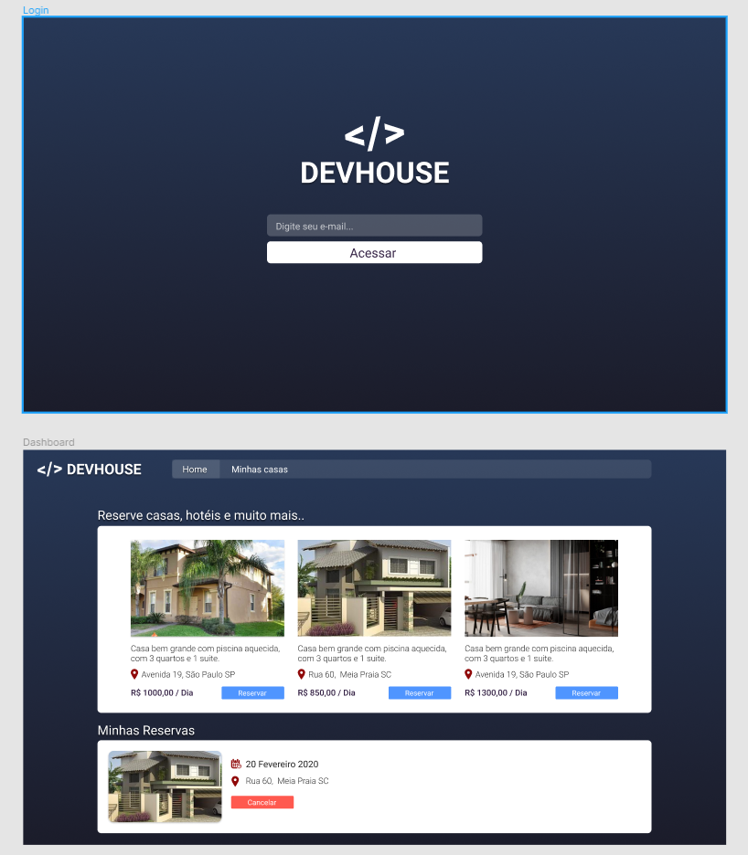

<h1 align="center">
  

  :satellite:<p> App DEV</>HOUSE
</h1>

<blockquote align="center"> “Faça seu melhor, mas sempre com prazo de entrega!”</blockquote>
<br>

  ## About this project
  <p align="center">
    This project is a simple creation of AIRBNB or objective is not the creation of another exactly the same.
Where the user will log in with his email.
You will be able to register new houses and apartments
and see availability two same.

The objective was to learn a RESTful software architecture, where a backend can be created completely independent of where an app could be created in the future, without needing to improve on any architecture.

<p align="center">
 
 
 
 
  </p>
  <div align="center">
  <span style="color:red">DevHouse is not yet complete - last commit 04/02/2023
</span>
  </div>

  <div align="center">
    <h1>How to contribuite</h1>
    <div align="justify">```
    
    
```bash
git clone https://github.com/deivid94/DevHouse.git

## Open project with or IDE and install dependencies:
  

npm  install yarn --global yarn

cd "#yourDirwithSaveTheproject/DevHouse"

yarn init -Y

yarn add express nodemon sucrase multer -D #  "-D only install in project"

#run project


dev yarn
# or

nodemon /src/server.js

```

  
  
  </div>
  </div>
<hr>
<p align="center">
    <a href="https://www.linkedin.com/in/deivid-martins1994/">
  	&nbsp;&nbsp;&nbsp;|&nbsp;&nbsp;&nbsp;
  <a href="https://github.com/deivid94">
   &nbsp;&nbsp;&nbsp;|&nbsp;&nbsp;&nbsp;
  <a href="https://www.hackerrank.com/md031194">
   

</p>